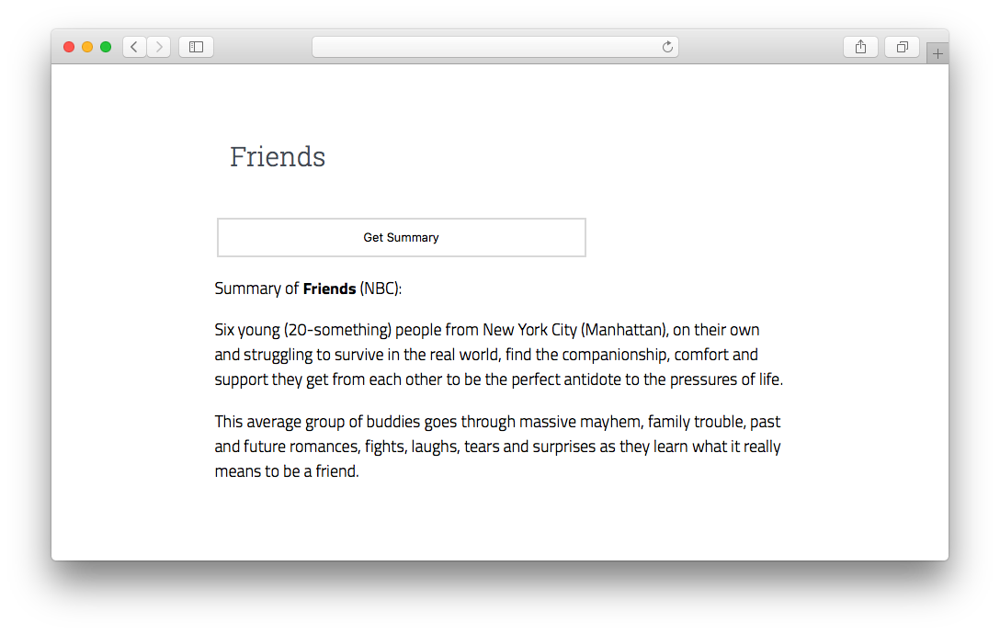

# TV Show Summary Searcher 

Live [here](https://tv-summary-searcher.herokuapp.com/)! (hosted with Heroku)

Search for a TV show's Summary with this Node.js web application (uses [TVMaze APIs](http://www.tvmaze.com/api))

[](https://tv-summary-searcher.herokuapp.com/)

## Installing and Running 
Run this app with 
```
$ node server.js 
```
Then the page will be live at [localhost:3000](http://localhost:3000/)
